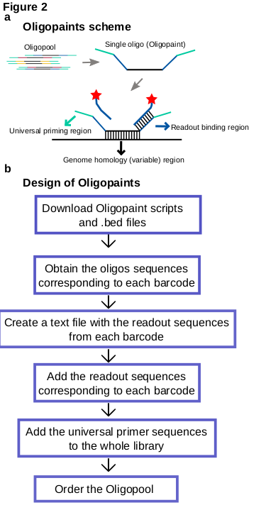

# Hi-M protocol

*Hi-M: Direct and simultaneous observation of transcription and chromosome architecture in single-cells*

[TOC]

## Experimental design

The Hi-M protocol presented here (Fig. 1) consists in the design and amplification of Oligopaint probes (steps 1-39 and Fig. 2), collection and fixation of Drosophila embryos (steps 40-50), RNA and DNA labeling of embryos (steps 51-92), sample mounting (steps 93-100 and Fig. 3), sequential imaging of multiple genomic locations (steps 101-116 and Figs. 4-6), and image processing and analysis (steps 117-149 and Fig. 7-8) in order to reveal chromatin organization and its relationship with the transcriptional status of single nuclei (Fig. 9).  

### **Oligopaint probes.**

The method is based on massive oligonucleotide synthesis to design probes targeting the genomic locations of interest to perform a FISH-based labeling approach(Boyle et al. 2011). This protocol describes how to design a library and amplify Oligopaint probes. Oligonucleotide primary probes contain three regions (Fig. 2): (1) a region of genomic homology composed of 42-nt complementary to the target locus, (2) a readout region composed of 32-nt complementary to a readout oligo bearing a fluorophore, and (3) two flanking 20-nt regions containing primers for the  PCR amplification of the whole Oligopaint library. With this design, it is possible to include 2 readout sequences per primary oligo, in the 5’- and 3’- ends of the genomic homology region. 

The design pipeline implemented in the current protocol is based on a previous development by Beliveau et al.(Beliveau et al. 2015) and requires the user to input the genomic region of interest and the number of probes per barcode or, alternatively, the genomic size per barcode (Fig. 2a). The unique sequences were mined using OligoArray(Rouillard, Zuker, and Gulari 2003) and are available online for a variety of species (Oligopaint website, https://oligopaints.hms.harvard.edu/). An alternative for the design of oligopaint primary probes, although limited to the human genome, is the use of the web interface (http://ifish4u.org) that allows for the selection of specific sets of oligos in a user-friendly environment including ~400 validated probes(Gelali et al. 2019). Of note, a recent development, OligoMiner(Beliveau et al. 2018), relieve the use of online databases as it is capable of discovering thousands of oligo probes in minutes, tailoring the design of each probe set to the experimental question at hand. 

A minimal number of primary oligos per barcode is needed for a high enough SNR to detect barcodes with high localization precision. Currently, we use a minimum of 40 primary oligos/barcode (i.e. 80 fluorophores per barcode). This number is comparable to the 48 fluorophores used typically for single-molecule RNA FISH(Raj et al. 2008). Given an average of 12 unique primary oligos per kb in Drosophila(Beliveau et al. 2018), a probe can be as short as ~3 kb. In the human genome, the average number of primary oligos/kb is considerably lower, thus we would recommend using a probeset spanning ~5 kb to ensure robust detection is most systems and conditions. Recently, a different oligo dataset has been mined with a higher density of probes/kb (Gelali et al. 2019)., possibly enabling for a reduction in the genomic size of the barcode. The fiducial barcode requires additional considerations, as it will need to be repeatedly imaged in each cycle of hybridization (i.e. it will suffer more from photobleaching than standard barcodes). Thus, we recommend using a higher number of primary oligos for the fiducial barcode (e.g. 200 oligos spanning ~20 kb). Currently, we fit the position of the fiducial barcode by using a 3D Gaussian function, as the image of this barcode is a diffraction-limited spot. It is important to realize that if the genomic region occupied by the fiducial barcode becomes too large, its image in the camera will not be diffraction-limited. This would need to be taken into consideration for the fitting of the position of this barcode by appropriate modifications in the analysis pipeline. 

For library amplification, the protocol follows a strategy previously introduced by Moffitt and Zhuang for the detection of RNAs using combinatorial approaches (J. R. Moffitt and Zhuang 2016). In short, library amplification consists of four steps: (1) the Oligopaint library is PCR-amplified using a reverse primer that adds the T7 promoter sequence, (2) the PCR product is converted to RNA via an in vitro transcription using T7 polymerase, (3) single-stranded DNA is generated via reverse transcription, and (4) the RNA template is degraded using alkaline hydrolysis (Fig. 2b). Quality and concentration are monitored during the different steps to ensure the success of the amplification and purification process (Fig.2 c-e). 

### **Embryo collection and fixation**. 
The protocol here does not deviate much from a previously published protocol(Trcek et al. 2017). Flies lay embryos on yeasted agar plates for 1.5 h. Plates are incubated at 25 °C until embryos reach the desired developmental stage. Embryos are then collected, dechorionated by the use of bleach, thoroughly rinsed with water and immediately fixed by using formaldehyde and formaldehyde-saturated heptane. Fixative is then removed, methanol added and embryos vortexed. Embryos that sank to the bottom of the tube are devitellinized, which is critical to allow penetration of FISH probes into the sample. Devitellinized embryos are washed with methanol and stored at -20 °C until further use.

###  **RNA & DNA FISH**. 
The protocol has two main steps: RNA in situ hybridization followed by DNA Oligopaint FISH. To ensure RNA signal preservation after DNA FISH, tyramide signal amplification (TSA), adapted from a previous protocol(Shpiz, Lavrov, and Kalmykova 2014) is performed. The single-stranded digoxigenin-labeled RNA probe is obtained from an in vitro transcription reaction in the presence of digoxigenin haptenes as described elsewhere(Cardozo Gizzi et al. 2019; Boettiger and Levine 2013). RNA probes are targeted with a specific antibody that is coupled to horseradish peroxidase (HRP). HRP then reacts with hydrogen peroxide creating tyramide free radicals from fluorophore-labeled tyramide, that will covalently bind to the vicinity of the RNA probe. It is possible to label a second RNA species by performing a sequential, second antibody/HRP incubation against a biotinylated probe. In any case, controls should be made to ensure specificity of the RNA probe/s. In our previous paper(Cardozo Gizzi et al. 2019), we labeled the snail gene, that has a distinctive spatial expression pattern that can be used to assert signal specificity. However, we did include a control sample without RNA probe to establish the expected background levels. In case the expression pattern of the target gene is homogenous (or unknown), an anti-sense probe can be used to verify that the sense probe is actually binding to the target RNA.    

After the TSA reaction, DNA FISH is performed based on a previous method(Bantignies and Cavalli 2014) that we have optimized for Oligopaint hybridization. 

###  **Embryo attachment**. 
Firm attachment of embryos to the flow chamber coverslip is essential to resist the pressure from non-continuous flow rates during a 2-3 day experiment. To this end, embryos are deposited and oriented on an agarose pad and then transferred to a glass coverslip coated previously with poly-L-lysine. The microfluidics chamber is then assembled and the system filled with liquid. The complete procedure is shown in Fig. 3.

For a different type of sample, tests should be performed to assure stable attachment. This should  not be a problem if adherent cells are used. A control with a labeled sample (e.g. using fiducial markers), imaged before and after a certain period of time (~30 min) of continuous flow and at the beginning and at the end of a full experiment should be performed to assess sample stability and stage drift. The software analysis pipeline corrects for stage drift (see Image analysis section), but if the sample become loose or detaches during the experiment, drift correction would not be possible. 

Image acquisition. Hi-M requires three acquisition steps. The pre-sequential step involves the acquisition of 3D bright-field, and multi-color fluorescence images for each ROI. The channels in the pre-sequential step are as follows: [channel 1] 3D image for DNA masks (DAPI-stained nuclei, excited using the 405 nm laser line); [channel 2] 3D image for RNA (RNA-stained embryos excited using the 488 laser line); [channel 3] 3D image of the fiducial barcode used for image registration (obtained by using the 561 nm laser line).

The sequential imaging acquisition step involves sequential imaging of barcodes. For each cycle of hybridization (see below) a 3D, two-color fluorescence image is acquired: [channel 1] 3D image of the fiducial barcode (excitation using the 561 nm laser line); [channel 2] 3D image of the N-th barcode (acquired using the 641 nm laser line). Thus, for N cycles of hybridization and k ROIs one obtains k(2N+4) three-dimensional images. In a typical experiment with 10 embryos (~30 ROIs) and 22 barcodes, one needs to analyze a total of 1440 3D images. In our current implementation, the acquisition time for 22 barcodes and ~30 ROIs (i.e. 7-9 embryos) is around 24 h. This time scales linearly with the total number of barcodes and ROIs. Drosophila embryos in nuclear cycle 14 have ~6,000 nuclei, thus ~25,000 nuclei can be retrieved in a single experiment.

Each cycle of hybridization involves the following steps: (1) injecting a solution containing the fluorescent readout oligo that will hybridize to the complementary sequence of the primary oligos of a barcode, (2) washing non-specifically bound or unbound readout oligos with a formamide-containing solution, (3) injecting an imaging solution including an oxygen scavenger enzymatic reagent to prevent photobleaching during acquisition, (4) stopping flow and perform the sequential imaging step described above for all desired ROIs, (5) bleaching barcodes (see below).

The bleaching step can be achieved by different means: (1) light-induced photobleaching using a high-power laser. The implementation of this option is straightforward but the time required for photo-bleaching all ROIs scales linearly with the number of acquired ROIs; (2) chemical bleaching. This option requires the fluorescent molecule in the readout oligo to be attached via a disulfide linkage cleavable by the use of a mild reducing agent such as Tris(2-carboxyethyl)phosphine (TCEP)(Jeffrey R. Moffitt et al. 2016). The advantage of this option is that all fluorophores are removed at once in a single step, making the bleaching time independent of the number of acquired ROIs. We note that if chemical photobleaching is employed, the fluorophore in the fiducial barcode needs to be resistant to the reducing agent (i.e. do not use a disulfide linkage). 

In the final acquisition step, a 3D bright field image for each ROI is acquired for a second time. This image is used later to verify that embryos did not detach during acquisition (see Controls below).

### **Image analysis.** 
The first image analysis step involves the deconvolution of images to remove out-of-plane light to increase the SNR and contrast. We perform this operation using Huygens (SVI, Nederlands). 

The second step involves the comparison of bright-field images of embryos before and after sequential imaging. Embryos displaying any apparent movement or morphological distortion are discarded from further analysis.

Next, a custom-made code in MATLAB is used to perform the following image analysis steps after deconvolution (Figs. 7-8). 

The workflow starts with the segmentation of nuclei from pre-sequential images using a graphical user interface (GUI). A number of parameters can be pre-tuned  (threshold, z-range, etc.) (Fig. 8) and manually modified in the GUI. Next, the GUI loads the stack, extracts the usable z-range, corrects for inhomogeneous excitation, and flattens the image by maximum intensity projection. Next, a detection algorithm with tunable parameters (threshold, intensity range, etc.) segments nuclei by using adaptive thresholding and water shedding. The masks are verified by the user and stored locally. Once parameters have been optimized and verified, all the ROIs can be analyzed in batch. 

A similar procedure is used to segment barcodes. This procedure involves loading the image, extracting the z-range, correcting for inhomogeneous excitation, and segmentation by local thresholding. An estimate of the 3D positions of barcodes is obtained from the center of gravity of the masks segmented in this step. These 3D coordinates are next refined by using a 3D gaussian fitting algorithm. 
Finally, a registration step is performed by image cross-correlation of the fiducial barcodes. A correction vector is derived and applied for each barcode. Corrected 3D barcode coordinates and nuclei masks are then used to determine which barcodes are associated with which nuclei. These data are used to calculate the mean absolute contact probabilities and normalized mean pairwise distances for each pair of barcodes (see heatmaps in Fig. 9).

### **Controls**. 
During in situ hybridization, chromatin is denatured by heating in the presence of formamide to enable the binding of primary probes. First, to ensure that this step did not affect the labeling of RNA,  it is necessary to compare RNA intensities and  distributions before and after DNA hybridization. 
Second, it is important to take steps to quantify the efficiency of hybridization of primary probes and the efficiency of binding of imaging probes. For this, it is useful to measure the distribution, the SNR, and the number of barcode spots per cell. These measurements should be performed for each barcode in several embryos. Barcode spots should appear dense and uniform across the field of view. In Drosophila, we typically observe that ~60–70% of nuclei display barcode spots, reflecting the limited labeling efficiency. In these cells, ~80% contain a single barcode, consistent with a high degree of homologous pairing(Fung et al. 1998; Cattoni et al. 2017). In mammalian cells instead, two barcode spots should be detected in most labeled cells. The typical SNR in our experiments was 50-500 after deconvolution. A reduced SNR could indicate incomplete binding of primary or imager oligos.

Third, a bright-field image is acquired before and after the experiment to ensure that embryos did not move during the experiment. During the analysis phase, it is verified that embryos did not change morphology or position during the experiment. Small-scale changes in embryos may happen during acquisition, such as inhomogeneous expansions/contractions of a few hundred nanometers. To account for these, fiducial marks are used. This allows us to both correct for stage drift as well as to account for any inhomogeneous expansion or contraction. 

Forth, Hi-M matrices should be generated from different regions of interest and for different embryos to test that the data is highly correlated (Pearson test on the Hi-M pairwise distances and contact probabilities). Finally, a consolidated Hi-M contact probability matrix is built and compared with existing Hi-C datasets (Pearson test on contact probabilities). Additionally, it can be verified that TAD borders are located at the same genomic position for both datasets. When available, comparisons of Hi-M matrices with other sources of data (e.g. ChIP-seq, enhancer trapping) is also important to ensure the validity of the results.
	
### **Spatial resolution.**
In our approach we avoid chromatic shift by using a single channel to record all barcodes. By recording in two channels, the number of hybridization cycles can be reduced by half. However, chromatic aberrations needs to be properly corrected, as described elsewhere (Cattoni et al. 2017). Stage drift is inherently present and also needs to be corrected using fiducial labels. The reported residual error of fiducial barcodes after drift correction is around 80 ± 60 nm in xyz(Cardozo Gizzi et al. 2019). Ultimately, this will limit the minimal distance that can be resolved between any two barcodes.